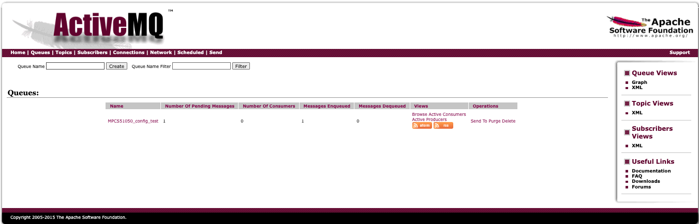
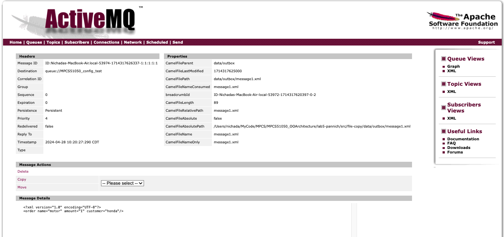
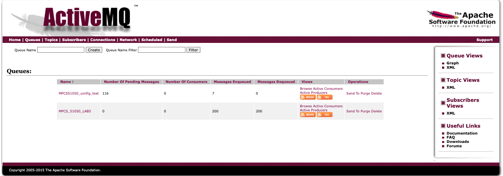

finalproject-pannich

### Submission

Enterprise Design :
### `ProducerRouter`
- [Point-to-Point] In Producer, `ProducerRouter` reads from data/inbox to the queue. Only one consumer, `OrderRouter`, reads from this queue .

### `Consumer`
- [Content Router + Pub-Sub] Consumer's `OrderRouter` uses Content router to classify stocks IBM, MSFT, ORCL, and publish to these topics according to stock symbols. [Invalid Message Channel] The messages that doesn't fall into any of these stocks categories are going into `jms:topic:UNHANDLED_MESSAGES` and ignored.
- [Message Translator] `ConsumerProcessor` translates message format from `String` to `double` for further statistics computation.
- [Message Enricher] `ConsumerProcessor` calls `StockStats` to do statistics computation and update on each stock statistics.

### `Subscriber`
- [Pub-Sub] Each Trade Engine is subscribing to the stock topics. ie. Tokyo Trade Engine subscribes to IBM and MSFT. London Trade Engine subscribes to IBM.

 Design Patterns :
 - [Strategy] StockStrategy : PremiumStats, SimpleStats. The trade engine that implements PremiumStats, its stocks will receive all the statistics update ie. min, max, ave, std, variance, but the SimpleStats has just min, max, ave.
 - [Iterator] StockStatsMap Iterator : I implemented Linkedlist to store collection of stockStats in each TradeEngine. ie. Tokyo has collection of "IBM" stats, "MSFT" stats. Iterator will help simplify iteration, allowing ReportEngine to iterate and printout the report without needing to know the underlying data structure.
 - [Singleton] ReportEngine : There will be only one ReportEngine for the entire application. ReportEngine will print all stockStats for any input TradeEngine.
 - [Template] TradeEngine -> TokyoTradeEngine, LondonTradeEngine, NewYorkTradeEngine.


---------------------------------------------------------------------


### Compile

1. Open eclipse
- On terminal, run
`sudo codesign --force --deep --sign - /Applications/Eclipse.app`
- Open Eclipse Application
- Compile eclipse project
```
mvn eclipse:clean
mvn eclipse:eclipse
```
- Download finalproject workspace

2. Start ActiveMQ server
- On terminal, run
`sudo activemq console`
- Open http://localhost:8161/admin/queues.jsp
3. Run java application in this order
- `ProducerRoute.java`  from the Producer Project
- Run `Main.java` from the Subscriber Project
- Run `OrderRouter.java` from the Consumer Project

### Result
- Printing Report for each Trade Engine
```

==== TOK Trade Engine Report ====
Stock: MSFT
Min Price: 39.81
Max Price: 39.81
Average Price: 39.81

Stock: IBM
Min Price: 187.79
Max Price: 187.81
Average Price: 187.81

==== LDN Trade Engine Report ====
Stock: IBM
Min Price: 187.79
Max Price: 187.81
Average Price: 187.81
Standard Deviation: 0.01
Variance: 7.5E-5

```


 ---

### Set up environment
- Only do this during the first installation of activemq, camel, apache.
- edit PATH and execute
- export PATH in ~/.zshrc then `source ~/.zshrc`
```

# camel
export PATH=/usr/local/camelinaction-2.15.6/bin:$PATH

# apache
export PATH=/usr/local/apache-maven-3.6.1/bin:$PATH

# activemq
export ACTIVEMQ_HOME=/Users/nichada/MyCode/MPCS/MPCS51050_OOArchitecture/apache-activemq-5.15.12
export PATH=$PATH:$ACTIVEMQ_HOME/bin

# java
export JAVA_HOME=/Library/Java/JavaVirtualMachines/jdk1.8.0_161.jdk/Contents/Home
export PATH=$JAVA_HOME/bin:$PATH

```

- I also changed the apache permission with

```chmod +x /Users/nichada/MyCode/MPCS/MPCS51050_OOArchitecture/apache-activemq-5.15.12```

- run maven
```
mvn clean install
mvn compile
```

### Example Running activemq (Lab5)
1. Go to the example folder in CamelInAction `file-copy/` , run
```
mvn compile
mvn exec:java -Dexec.mainClass=camelinaction.FileCopierWithCamel
```

- open http://localhost:8161/admin/queues.jsp




- open the message will match with file-copy/data/inbox/message1.xml



Note:
- Eclipse Workspace Location
	`/Users/nichada/eclipse-workspace`

3. Utilities : broadcaster.sh for 100 csv files

- This step makes the script executable and ensures it can be run from any directory.


```

mv broadcaster.sh /usr/local/bin/

chmod +x /usr/local/bin/broadcaster.sh

```

4. Result after Consumer consumes


